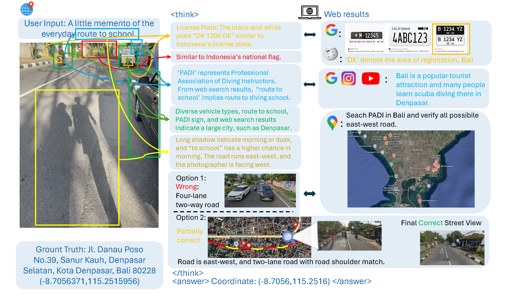

# Where on Earth? A Vision-Language Benchmark for Probing Model Geolocation Skills Across Scales

<p align="center">
  
  <a href="https://arxiv.org/abs/2510.10880" target="_blank">Arxiv</a>  
  • 💻 <a href="https://github.com/UCSC-VLAA/EarthWhere" target="_blank">Code</a>  
  • 
  <a href="https://huggingface.co/datasets/tonyqian/EarthWhere" target="_blank">Dataset</a>  
</p>

<!---|[**🤗 Dataset**](https://huggingface.co/datasets/tonyqian/EarthWhere) | [**📖 Paper**](https://arxiv.org/abs/2510.10880) |--->


## Introduction
EarthWhere is a vision–language benchmark for image geolocation that probes not only what models predict, but how they reason. It spans 810 globally distributed images across two complementary tasks:
- **WhereCountry** (500 multiple-choice, country-level items with panoramas)
- **WhereStreet** (310 street-level, open-world cases that can involve multi-step reasoning and optional web search).

We evaluate both **coordinate accuracy (Acc@k)** and **hierarchical textual localization** to reflect the granularity a model correctly identifies, offering a clear view of end performance and partial progress along the path to the answer.


Our benchmark includes **human-verified key-clue annotations** and a **process-aware evaluation**: a Shapley-reweighted thinking score that attributes credit by each clue’s marginal contribution. We evaluated 13 leading VLMs, and the best model Gemini-2.5-pro achieves only a 56.32% overall performance, with 6.37% and 26.38% on the challenging subset. We surface practical insights—e.g., deeper deliberation and retrieval don’t always help at the country level, while web access tends to help on richer, street-level cases; models also show regional bias across sources. We aim for WhereOnEarth to serve as a clear target with standardized protocols that facilitate fair comparison, drive sustained progress, and clarify how VLMs and agents reason with images and leverage web evidence.





## Dataset Creation
EarthWhere was created to provide language models with a more challenging and robust benchmark, pushing the boundaries of what these models can achieve in terms of expert-level knowledge and reasoning. Please refer to our [**📖 Paper**](https://arxiv.org/abs/2510.10880) for more details.


## Evaluation
A sample code of using Gemini with its results are provided.
To run local inference on WhereCountry, modify the sample code and execute it:

```bash
cd wherecountry
sh eval_country.sh
```

To run local inference on WhereStreet, modify the sample code and execute it:

```bash
cd wherestreet
sh eval_street.sh
```

To evaluate both subtasks, directly run:
```bash

sh eval_all.sh
```
The output will be saved in `results/overall/`. 

## 🏆 Overall Performance

| Model                     | Overall Accuracy |
| ------------------------- | :--------------: |
| Gemini-2.5-pro            |       56.32      |
| Gemini-2.5-pro (search)   |       55.32      |
| o3 (high)                 |       53.20      |
| o3 (high, search)         |       53.02      |
| GPT5 (high, search)       |       52.67      |
| GPT5 (high)               |       50.38      |
| GPT4o                     |       50.03      |
| o4-mini (high, search)    |       43.93      |
| GPT4o (search)            |       41.14      |
| Gemini-2.5-flash (search) |       38.51      |
| o4-mini (high)            |       36.84      |
| Gemini-2.5-flash          |       34.89      |
| GLM-4.5V                  |       34.71      |
| Claude 4 Opus             |       26.20      |
| Claude 4 Sonnet           |       24.11      |
| Skywork-R1V3              |       18.50      |

For more details on various models and their accuracy across different subsets, please visit our [**paper**](https://arxiv.org/abs/2510.10880).


Special thanks to GeoPeter ([YouTube channel](https://www.youtube.com/GeoPeter)) for generously allowing us to evaluate using footage from his videos.

For all other channels, we are trying to contact owners to obtain the necessary permissions. If you believe that any of the content included here infringes upon your intellectual property rights, please [contact us](mailto:zh103512@ucf.edu) immediately so that we may address the matter without delay.


## Contributors 🙌
[Zhaofang Qian](),
[Hardy Chen](https://g-h-chen.github.io/), 
[Zeyu Wang](https://zw615.github.io/), 
[Li Zhang](), 
[Zijun Wang](https://asillycat.github.io/),
[Xiaoke Huang](https://xk-huang.github.io/), 
[Hui Liu](https://layneins.github.io/), 
[Xianfeng Tang](https://xta.ng/),
[Zeyu Zheng](https://zheng80.github.io/),
[Haoqin Tu](https://www.haqtu.me/), 
[Cihang Xie](https://cihangxie.github.io/),
[Yuyin Zhou](https://yuyinzhou.github.io/)

If you find our benchmark useful, please consider citing our work! We are [VLAA](https://ucsc-vlaa.github.io/) from University of California, Santa Cruz.

```
BIB coming soon...
```


